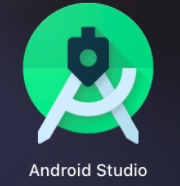
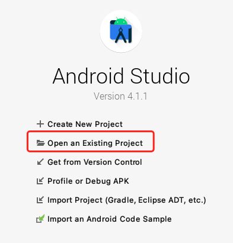
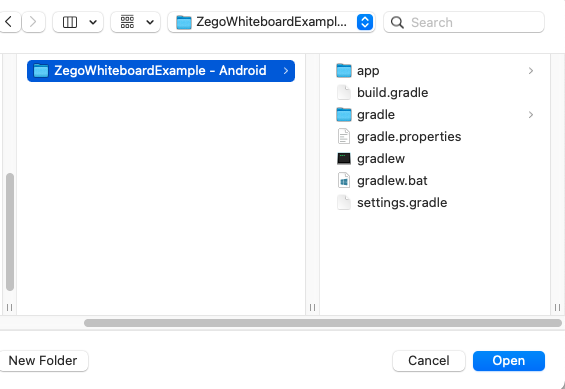
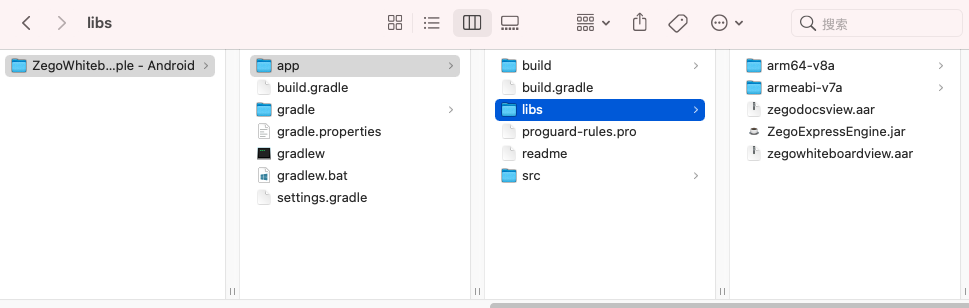
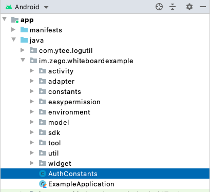
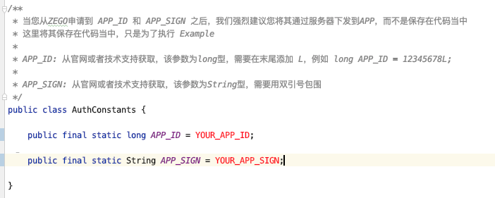
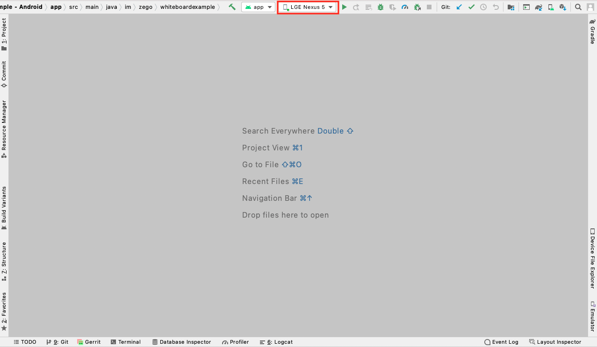
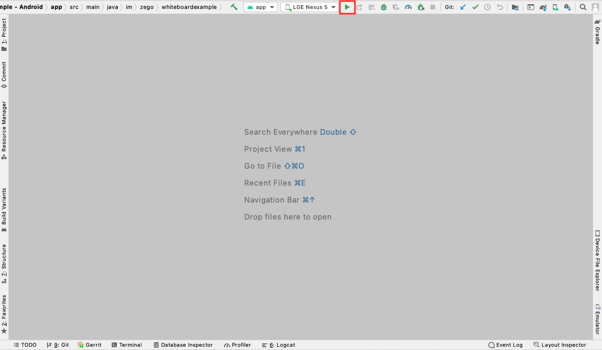
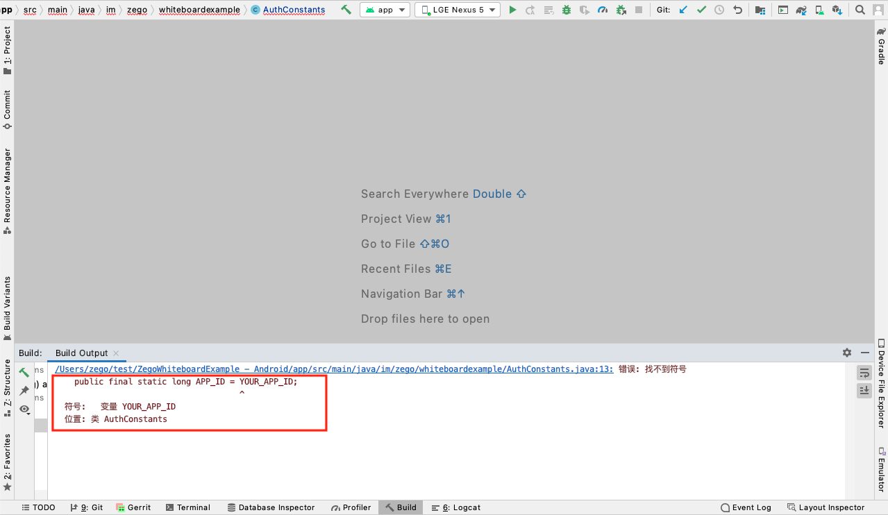

# 简介

ZegoWhiteboardExample是集成即构[互动白板SDK](https://doc-zh.zego.im/zh/4395.html)和[文件共享SDK](https://doc-zh.zego.im/zh/4399.html)的功能示例项目，开发者可通过该项目快速了解即构白板文件的功能和集成方式。
即构互动白板服务（ZegoWhiteboardView）和即构文件共享服务（ZegoDocsView），基于即构亿级海量用户的实时信令网络构建，支持在白板画布上实时绘制涂鸦并多端同步，同时提供图形、激光笔等工具，满足不同场景的在线协同需求；同时提供文件转换和点播相关功能，支持将常见文件格式转码为向量、PNG、PDF、HTML5 页面等便于跨平台点播的目标格式。

# 开发准备

#### 申请 AppID 与 AppSign
请到 [ZEGO 管理控制台](https://console-express.zego.im/account/login) 注册账号并申请 SDK 初始化需要的 AppID 和 AppSign，申请流程请参考[控制台 - 项目管理](https://doc-zh.zego.im/zh/1265.html) 。

#### 准备环境
请确保开发环境满足以下技术要求（以下说明皆以 MacOS 开发电脑为例)：

- Android Studio 4.0 或以上版本。
- 已经下载 Android SDK 30 和 Android SDK Platform-Tools 30.*.*。
- Android 版本不低于 5.0 且支持音视频的 Android 设备。
- Android 设备已经连接到 Internet。

> 首次编译示例源码时，没有对应的依赖库或者构建工具，Android Studio 会自行下载，可能需要较长时间，请耐心等待。
>
> 建议下载特定的 gradle 及所需的依赖库，请确保开发电脑已经连接到 Internet 且能正常访问 [https://services.gradle.org ](https://services.gradle.org/)。
>
> 示例源码中使用的gradle相关版本如下：
>
> - gradle： 6.5
> - gradle Android 插件： 4.1.3

# 快速启动
#### 1. 在开发电脑中找到 Android Studio 软件图标。
   

   > 若开发电脑上未安装该软件，可以参照如下方式操作：
   >
   > 方式1：登录 [Android Studio 官网 ](https://developer.android.com/studio)下载并安装Android Studio及其相关的SDK Tools。由于国内运营商网络限制等原因，开发者需要确保本机能连接该网站，若无法访问建议选择方式2。
   >
   > 方式2：使用搜索引擎搜索 `Android Studio 下载`、`Android Studio 安装` 和 `Android Studio SDK Tools 安装`，查找可下载的源网站，并安装相关软件和工具。

#### 2. 打开  Android Studio  软件，并单击 “Open an existing project”。

   

#### 3. 选择在本文档开头位置已下载好的示例源码并打开。

   

#### 4.下载的示例源码中缺少相关 SDK 包，需通过以下链接下载，解压后将相关文件放入项目的 “app/libs” 目录下。
- [互动白板 SDK](https://doc-zh.zego.im/zh/4405.html)
- [文件共享 SDK](https://doc-zh.zego.im/zh/4407.html)
- [Express-Video SDK](https://doc-zh.zego.im/zh/2969.html)**(请下载包含白板功能的版本)**

  

#### 5. 下载的示例源码中缺少 SDK 初始化所需的 APP_ID 和 APP_SIGN，需要修改 `AuthConstants.java` 文件。位置如下图：

   

请使用本文“前提条件”已获取的 AppID 和 AppSign 正确填写（**注意：需要在 AppID 后加 L**），否则示例源码无法正常运行。

   

#### 6. 选择一台已连接到 Internet 的 Android 真机设备（推荐）或模拟器，当该设备成功开启开发者模式和 USB 调试功能后，可以看到 Android Studio 变为下图：

   

   说明 Android Studio 软件已成功连接到 Android 设备，可以将示例源码运行到该设备上了。

   > 当开发电脑连接 Android 设备后，大部分设备会弹出提示，不同 Android 厂商的提示信息有所不同，可根据情况选择 USB 模式。
   >
   > 当 Android 设备连接开发电脑后，需要根据情况在该设备上开启开发者模式和 USB 调试功能（不同厂商的 Android 设备开启方式不同）。具体开启方式可以使用搜索引擎搜索。 例如：目前存在一台未开启过开发者模式与 USB 调试功能的 “魅族 Pro 5” 设备，可以在搜索引擎搜索 “魅族 Pro 5 开启开发者模式”，查看具体的开启教程。

#### 7. 单击 Android Studio 软件上的 “build and run” 按钮，编译并运行示例源码。

   

   > 若运行过程中出现问题，请联系 ZEGO 技术支持工程师。

# 获取帮助

ZEGO 文档中心有关于 [互动白板](https://doc-zh.zego.im/zh/4395.html) 以及 [文件共享](https://doc-zh.zego.im/zh/4399.html) 的详细介绍。

# 作出贡献

如果您发现了文档中有表述错误，或者代码发现了 BUG，或者希望开发新的特性，或者希望提建议，可以创建一个 Issue。请参考 Issue 模板中对应的指导信息来完善 Issue 的内容，来帮助我们更好地理解您的 Issue。

# FAQ

Q: **Android Studio 运行下载的示例源码时报 “找不到符号” 怎么办？**

   

由于下载的示例源码中，AppID 和 AppSign 没有具体的值，请参考本文“运行示例源码”章节中的步骤5进行处理。

# LICENSE